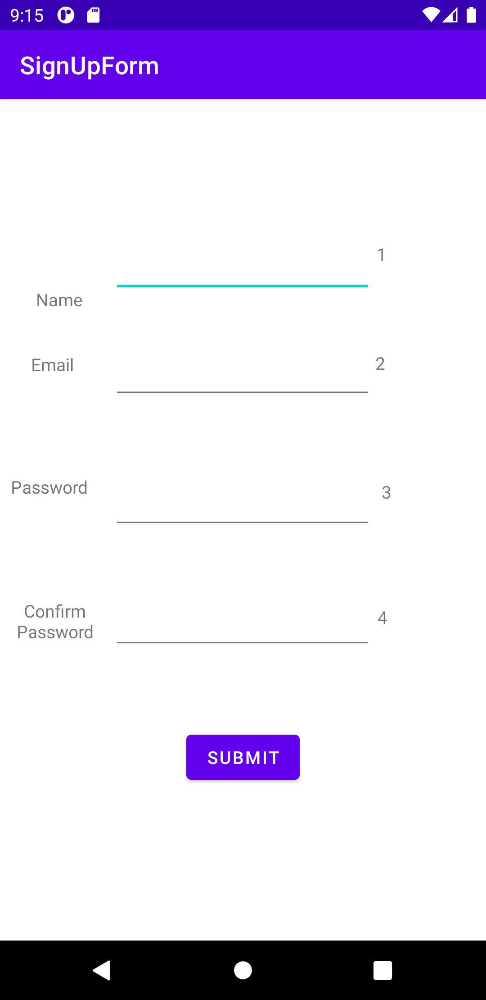
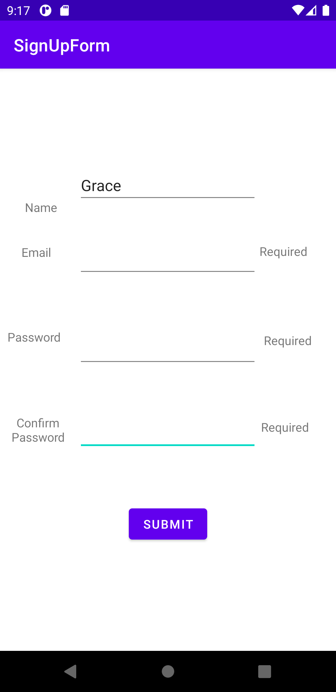
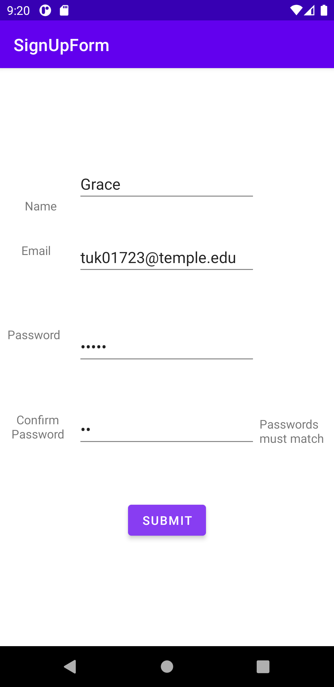
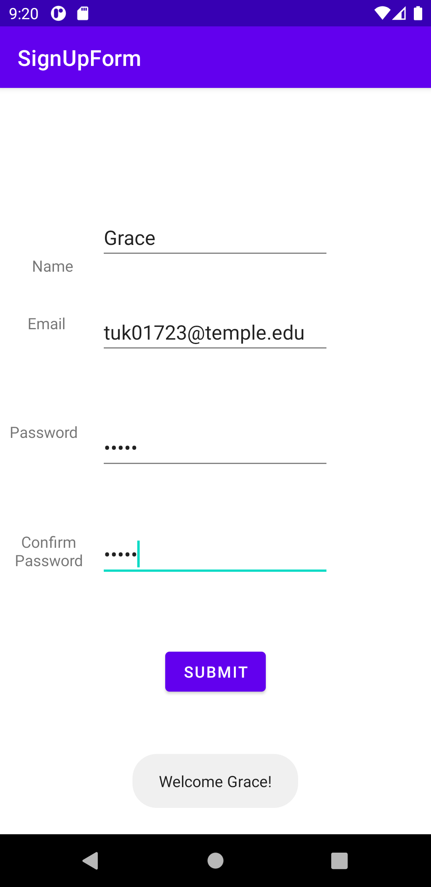

# 3515 Lab 2
# Grace Sobrinski

This Project demonstrates a simple Android form. The app UI shows four TextEdit boxes in which the 
user can enter their personal information. There is a label to the left of each entry that informs
the user of what they should enter. To the right of each entry, there is an invisible TextEdit box
that displays any submission errors. All four fields are required and the two password fields must
match. Below the TextEdits, there is a submission button. When the button is clicked, all four 
fields are retrieved from the page. These fields are then stored and error checked. If any fields 
do not meet the requirements, an error message will be inserted next to that field. If no errors are
found, a Toast message is displayed to the user that says "Welcome <<name>>". 

Main page of app:

Error message displayed when required fields are not filled out:

Error message displayed when passwords do not match:

Sucess!
